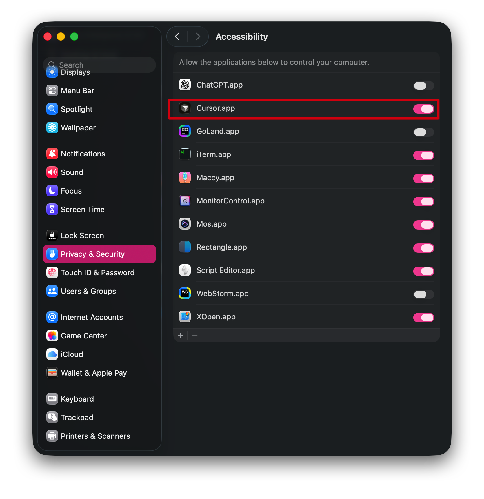
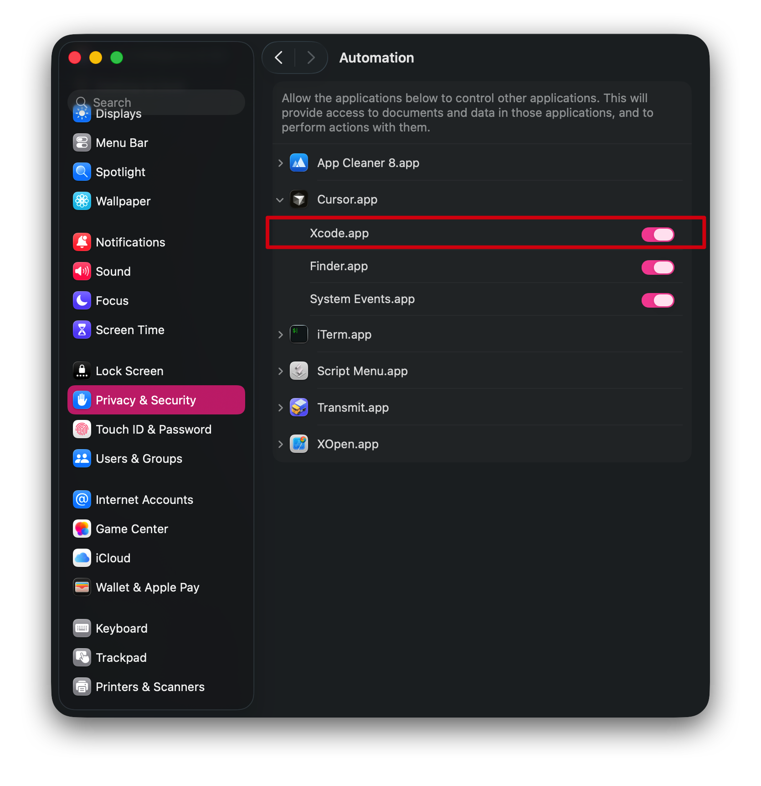

# XOpen: A vscode extension that opens current line in Xcode

## Usage

Press `⌥ Option` twice

To change the shortcut, go to `Settings` -> `Keyboard Shortcuts` and search for `xopen`.

XOpen also works with Cursor and Windsurf. 
## Installation

* [VSCode Extension Marketplace ](https://marketplace.visualstudio.com/items?itemName=moderato-app.xopen) 
 
* [Open VSX Registry](https://open-vsx.org/extension/moderato-app/xopen)

* [GitHub Releases](https://github.com/moderato-app/vscode-xopen/releases)
  * Download the latest extension package `.vsix`
  * In VSCode, select `Extensions`
  * Drag and drop the `.vsix` file

## Q&A / Troubleshooting

### Xcode Cannot Position to Column

If Xcode opens but cannot position to the correct column, you can try to enable the following permissions:

**1. Accessibility:** `System Settings` → `Privacy & Security` → `Accessibility` → Enable **VSCode**

**2. Automation:** `System Settings` → `Privacy & Security` → `Automation` → Enable **Xcode** for **VSCode**

**Note:** Restart VSCode after enabling permissions.

## Credits

* [switch2idea](https://github.com/qczone/switch2idea), a Cursor extension that enables smooth switching between Cursor and IDEA.

## License

This extension is licensed under the [MIT License](LICENSE).